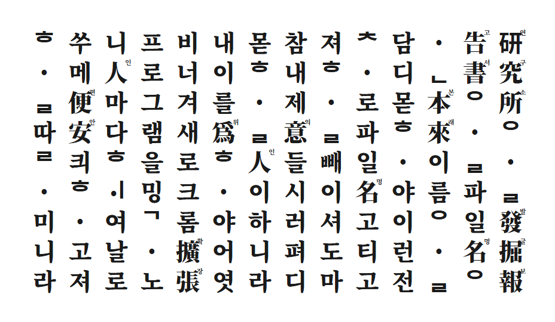

# 📜 국가유산 보고서 파일명 정리기

국가유산청 및 국립문화유산연구원 등의 학술 사이트에서 발굴조사보고서 PDF를 다운로드할 때, 페이지의 정보(발행기관, 발행연도, 보고서제목 등)를 자동으로 분석하여 참고문헌식 파일명으로 정비하여 저장해 주는 Chrome 확장 프로그램입니다.

또한, 현재 보고 있는 보고서의 학술 인용문(`조사기관명, 발행년도, 『보고서명』`)을 원클릭으로 클립보드에 복사할 수 있어 인문학 연구 효율을 돕습니다.

---

## ✨ 주요 기능

| 기존 파일명 😩 | 변환 후 파일명 😌 |
|---|---|
| `20260609_download.pdf` | `(재)한울문화유산연구원, 2026, 울산 서하리 240-1번지 유적.pdf` |
| `file(1).pdf` | `국립경주문화유산연구소, 2021, 경주 월성 시·발굴 조사 보고서 1.pdf` |
| `attach_123456.pdf` | `전북문화재연구원, 2009, 정읍 고부구읍성 2.pdf` |

*   **참고문헌식 파일명 정리**: 기본 파일명 저장 형태는 `[발행기관], [발행연도], [보고서제목] [순서번호].pdf` 입니다. 여러 파일 다운로드 시 숫자가 순차 자동 부여됩니다.
*   **원클릭 학술 인용 복사**: 팝업 내 **보고서 인용** 탭에서 조사기관, 발행연도, 겹낫표(`『 』`) 처리된 보고서제목이 결합된 공식 학술 인용 형식으로 클립보드 복사할 수 있습니다.
*   **실시간 미리보기**: 사용자가 현재 보고 있는 웹페이지의 실제 데이터를 바탕으로 가공될 파일명을 팝업창 내에서 실시간으로 확인하고 템플릿을 조합해 볼 수 있습니다.
*   **파일명 템플릿 맞춤 설정**: 드래그 앤 드롭으로 파일명 칩(보고서제목, 발행기관, 발행연도, 허가번호, 조사 시도 등)과 구분자를 자유롭게 배치하여 저장 규칙을 수정합니다.
*   **아이프레임(iframe) 대응**: 상세 정보 테이블이 아이프레임 내부에 별도 로드되는 구조에서도 데이터 추출이 차단되지 않도록 백그라운드 캐시 시스템을 탑재했습니다.

---

## 🏛️ 지원 사이트

*   🏺 **국가유산포털 간행물** (`heritage.go.kr`)
*   📚 **국가유산 지식이음 발간자료** (`portal.nrich.go.kr`)
*   🗂️ **정부24 국가유산청 발굴조사보고서** (`e-minwon.go.kr`)

---

## 🚀 설치 방법

1. 본 저장소를 다운로드하거나 복제(`git clone`)합니다.
2. Chrome 브라우저에서 `chrome://extensions` 주소로 이동합니다.
3. 우측 상단의 **개발자 모드** 토글을 활성화합니다.
4. 좌측 상단의 **압축해제된 확장 프로그램을 로드합니다** 버튼을 누릅니다.
5. 본 폴더를 선택하여 로드합니다.
6. 대상 보고서 상세 페이지로 이동한 후, 페이지를 새로고침(F5)하여 사용을 시작합니다.
